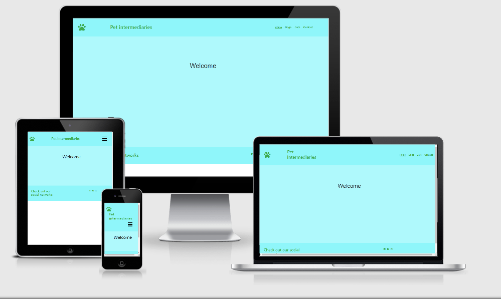

<h1 alignt="center ">Pet intermediaries</h1>

<h2 align="center">

## About 

This website was created to make it easier for people to get  in touch with breeders and show what
of common breeds there is for both dogs and cats. During these trying time with social distancing
is there good reason to get a pet that help one so don't need to feel alone. Pets a very good 
way not feeling alone. 

## User Experience (UX)

### User Stories 

    ### I want to able to get a pet easy way. 

    * I want a site that is easy to navigate. 
    * I want to be able to get easy read on different breeds. 

    ### When I visit the site I want to be able to get in contact with breeders.

    * I want t be able to see the most common breeds. 
    * Easy way to get the one type of pet I am interrested in.

    ### As a visitor that want to look it through a mobile phone.

    * I want to be able to look through the phone when I am feeling lazy. 
    * Be able to show for my housemates what I found in a easy way. 

### Design 

    - ### Colours 

    - The colours that was choosen for the site was making more pleasent and more light. I used 
    for background rgb(175, 249, 252) for the main page background for the pleasent color. 
    rgb(143, 246, 250) was used on the header and footer to make a different between the main 
    page from the header and footer. I used on the header links, name of the site and the icon
    in rgba(50, 163, 56, 0.89) color. For the paragraphs I used rgb(48, 243, 123) in the backgroundcolor
    for making it light and easy to read. 

    -### Typography

    - I used on the H the font-family of Exo for making a little more elegant. 
    - For the paragraphs I used Merriweather for the stylish way to read and more pleasent for the eyes. 

    - ### Imagery 

    - The images had simple purpose to show how the different breeds looks like. 
    Making it easier to know what to look forward when getting the specific breed. 

    - ### Wireframes 

    - Wireframes was created using Balsamiq Wireframes. The design diden't look like the end result
    but its more like a guidance. 

    ## Features

    ### Header

    - The header shows to the left a paw for its about pets. It is also possible to click on it to 
    return to main page. 
    - Later you can see the title of the page.
    - The navbar to the left goes to different pages. When mobile form to navbar collapse. 

    ### links

    - You can see wich page you are on because the site you are on will have a bottom border to easy to navigate.
    - Its easy named for make it simple to know wich page ones goes to. 

    ### Footer 

    ### The pages

    - ### Home
    - One to welcome one when coming to the page.
    - Giving information what the page is about. 

    - ### Dogs 
    - Showing different breeds of dogs there is.
    - Need to push the read more button to be able to get some information. 

    - ### Cats
    - Showing different breeds of dogs there is. 
    - Need to push the read more button to be able to get some information. 

    - ### Contact
    - Contact page for getting in touch with different breeders. 

    ## Technologies used

    ### Languages used

    - HTML5
    - CSS3
    - JavaScript

    ### Frameworks and programs used

    - Bootstrap v5.0.0-beta1 - Used Javascript through Bootstrap and the navbar, footer header and the content using the grid system and media.
    - Git hub - For mine repositories and my code with my website site is located there. 
    - GitPod - The site I used for coding the entire site. 
    - Google Fonts - Used Google Fonts to import the font-family for my site. 
    - Font Awesome - The images used for social links was imported from Font Awesome. 
    - Balsamiq Wireframes - Balsamiq was used to do the Frameworks.
    - Jquery - Used for JavaScript functions. 

    ## Testing

    ### Functionality Testing

        - ### Navigation bar 
        - Testing with both mobile and desktop.
        - The Functionality worked very well on both.

    ### CSS3 Validator

        - Passed- [Result] (https://jigsaw.w3.org/css-validator/validator)

    ### HTML5 Validator

    - Home page - Pass - [Result](https://validator.w3.org/nu/?doc=https%3A%2F%2Fkartextiarc.github.io%2FMS2%2Findex.html)
    - Dogs page - Pass - [Result](https://validator.w3.org/nu/?doc=https%3A%2F%2Fkartextiarc.github.io%2FMS2%2Fdogs.html)
    - Cats page - Pass - [Result](https://validator.w3.org/nu/?doc=https%3A%2F%2Fkartextiarc.github.io%2FMS2%2Fcats.html)
    - Contact page - No Pass - [Result](https://validator.w3.org/nu/?doc=https%3A%2F%2Fkartextiarc.github.io%2FMS2%2Fcontact.html)

    ### Comatibility Testing

        - Browser Compatibility 

        - Testing on Chrome mobile and desktop - Pass
        - Testing on safari mobile and desktop - Pass

    ### Performance Testing

        - Lighthouse Testing
        - Testing on Desktop

        

        - Test on mobile

        

    #### Testing User Stories

    - #### I want to able to get a pet easy way. 

    * I want a site that is easy to navigate. 
    1. The page is easy to navigate. 
    * I want to be able to get easy read on different breeds. 
    1. It shows in the navbar what kind of animals and there is for kind of breeds. 

    - #### When I visit the site I want to be able to get in contact with breeders.

    * I want t be able to see the most common breeds. 
    1. There is pictures and information on each breed to make it easier. 
    * Easy way to get the one type of pet I am interrested in.
    1. The contact site make it easy to send request what kind breed one is after. 

    - #### As a visitor that want to look it through a mobile phone.

    * I want to be able to look through the phone when I am feeling lazy. 
    1. The site with toggle buttons make it easier to navigate the site. 
    * Be able to show for my housemates what I found in a easy way. 
    1. It is easy to show for other the site. 

    ## Deployment

    ### Publishing

    ### GitHub Pages

    This site was publiched with [GitHub Pages](https://pages.github.com/). How to create a GitHub page is below. 

    1. Go to the GitHub website and create a log in. 
    2. On the left you will see your repositories (if you have created one), select the one you want to set up a page for. 
    3. Above the repositories you will see a menu. To the right you will find one that say "Settings". 
    4. Then go down to GitHub pages.
    5. Choose master as source and then you click save. 
    6. Refresh the site and scroll back to GitHub pages and there is your link. 

    ### Forking the GitHub Repository

    By forking the GitHub repository it will make a copy of the original repository on the GitHub 
    account to view and/or make changes without affecting the original.

    1. Log in to GitHub and locate the GitHub repository.
    2. At the top to the right of the page is the "Fork" Button.
    3. Press it and now it should copy the original repository to your GitHub account.

    ### Content

    - All the code was written by - Christoffer Nyh.
    - To get the right colour schemes Balsamiq Wireframes was used. 
    - The README file was formed after the Code Institute Sample Read. 

    ### Media 
    - Pictures was downloaded from [Unsplash](https://unsplash.com/)
    

    ### ### Acknowledgements

        - Thanks for the tutors that helped with technical problems.  
        - Thanks to evryone that gave me advice and feedback about my page. 
        - Very much thanks to my Mentors for helping with this project. 